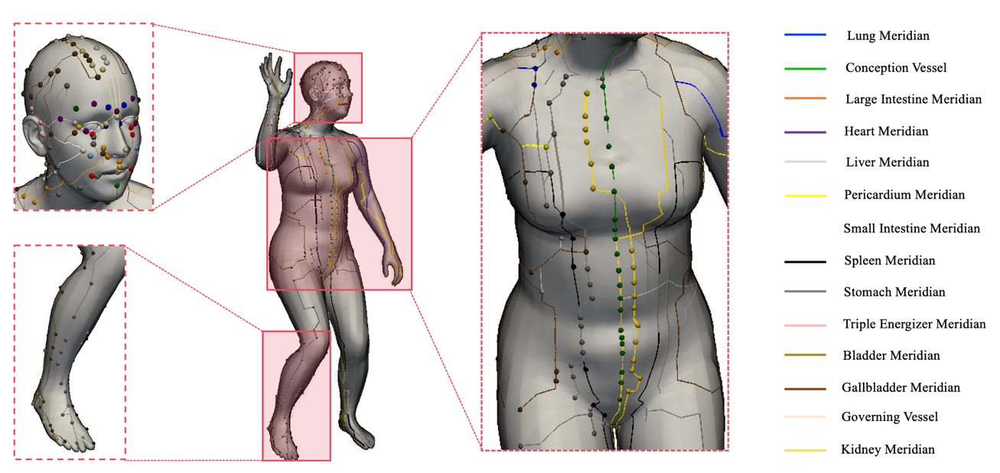

# SMPLify-M: Efficient 3D Human Reconstruction and Dynamic Acupoint Mapping Framework

## Project Overview

This repository provides the official implementation of the paper:

**"Efficient 3D Human Reconstruction and Dynamic Acupoint Mapping for Digital Traditional Chinese Medicine"**

(submitted to *The Visual Computer*)

This work proposes **SMPLify-M**, a cascaded framework combining deep learning initialization with optimization refinement for 3D human reconstruction and acupoint localization from monocular images.

### Key Contributions

* Propose **CBAM-MobileNetV3** as a lightweight human parameter initialization network
* Construct a cascaded reconstruction pipeline: "**Learning-based Initialization + SMPLify-X Optimization**"
* Improve reconstruction accuracy and convergence stability while maintaining lightweight design
* Support 3D human parameter recovery and dynamic acupoint mapping under complex poses

---

## Quick Start

### 1. Run Complete Pipeline (Recommended)

```bash
python run_smplifyx_mobilenet.py
```

---

### 2. Run Initialization Network Only

```bash
python run_mobilenet_integration.py
```

---

### 3. Example (Single Image)

```bash
python run_smplifyx_mobilenet.py --input data/images/test.jpg
```

---

## Visual Results

### 3D Human Reconstruction Results


*Figure 1: 3D human reconstruction using CBAM-MobileNetV3 initialization + SMPLify-X optimization*

---

### Acupoint Localization Results



*Figure 2: Dynamic acupoint localization and meridian visualization based on 3D human mesh*

---

## Method Overview

The proposed method consists of two stages:

### Stage 1: Parameter Initialization (CBAM-MobileNetV3)

Input a single RGB image to predict SMPL-X parameters:

* Body pose
* Body shape (betas)
* Global orientation
* Hand/facial parameters (optional)

---

### Stage 2: SMPLify-X Optimization (Refinement)

Optimize with the following constraints:

* 2D keypoint reprojection error
* Pose prior (VPoser)
* Shape prior
* Hand/facial priors
* Optional collision constraints

Final outputs:

* 3D human mesh (.obj)
* Parameter file (.pkl)
* Acupoint and meridian visualization results

---

## Environment Setup

### Verified Environment

* Python: 3.6.13
* PyTorch: 1.10.2
* CUDA: 11.x
* OS: Ubuntu 18.04 / WSL

---

### Installation Steps

```bash
conda create -n smplify-m python=3.6.13
conda activate smplify-m

pip install -r requirements.txt
```

For acupoint visualization, also install:

```bash
pip install pyvista
```

---

## Data Organization

This project includes two types of data usage:

### Type 1: Training Data for Image Regression Model

This data is used to train the image-to-SMPL-X parameter regression network, located in:

```text
mobilenetv3-master/data/
├── img/      # Training images
└── label/    # Corresponding labels
```

Where:

* `img/`: Training images
* `label/`: Corresponding supervision labels

> **Note**: Due to company data confidentiality, this training dataset is not publicly available.

---

### Type 2: SMPLify-X Optimization Input Data

The `data/` directory in the root folder is used for the final SMPLify-X optimization iteration, organized as:

```text
data/
├── images/      # Input images
└── keypoints/   # 2D keypoint labels generated by OpenPose
```

Where:

* `images/`: Raw input images
* `keypoints/`: OpenPose 2D keypoint JSON files with the same names as images

This data is used for:

* Keypoint-driven SMPLify-X optimization
* Cascaded pipeline: CBAM-MobileNetV3 initialization + SMPLify-X refinement

---

## Model Weights

### CBAM-MobileNetV3 Pre-trained Weights

**Weight download link to be provided**

Please place the downloaded weight files in:

```text
mobilenetv3-master/smplify_pth_retrain/
```

### SMPL-X Model Resources

Please prepare the following resources yourself:

* **SMPL-X Model**: https://github.com/vchoutas/smplx
* **VPoser Model**: https://github.com/nghorbani/human_body_prior
* **Homogenus Resources**: https://github.com/nghorbani/homogenus

Recommended directory structure:

```text
smplify-m/
├── smplifyx/          # Main optimization code
├── models/            # SMPL-X model files
├── vposer/            # VPoser model files
├── homogenus/         # Homogenus resources
└── ...
```

Directory placement example:

```
models/
└── smplx/
    └── SMPLX_NEUTRAL.npz

vposer/
└── vposer_v1_0/
    └── snapshots/
        └── VPoser_v1_0.ckpt
```

---

## Reproducing Paper Results

Follow these steps to reproduce the main experimental results:

### Step 1: Prepare Model Resources

1. Download and configure SMPL-X model
2. Download and configure VPoser model
3. Download CBAM-MobileNetV3 pre-trained weights

---

### Step 2: Prepare Input Data

Place test images and corresponding OpenPose keypoints in:

```text
data/
├── images/
└── keypoints/
```

---

### Step 3: Run Complete Pipeline

```bash
python run_smplifyx_mobilenet.py
```

---

### Step 4: View Output Results

```text
OUTPUT_FOLDER/
├── results/        # SMPL-X parameter files (.pkl)
├── meshes/         # 3D human meshes (.obj)
└── images/         # Visualization results
```

---

## Comparative Experiments

This project supports comparative analysis of multiple backbone networks:

| Network Architecture | Parameters | Characteristics |
|---------------------|------------|-----------------|
| MLP | Minimal | Baseline model |
| ResNet50 | Large | Classic backbone |
| ConvNeXtV2 | Large | Modern ConvNet |
| Swin Transformer | Large | Transformer architecture |
| U-Net | Medium | Encoder-decoder |
| MobileNetV3 | Small | Lightweight network |
| **CBAM-MobileNetV3** | **Small** | **Our method** |

For analyzing the performance of different architectures in human parameter regression tasks.

Comparative experiment code is located in:

```text
comparative_experiments/
└── models/
    ├── model_mlp.py
    ├── model_resnet.py
    ├── model_convnextv2.py
    ├── model_swin.py
    ├── model_unet.py
    ├── model_mobilenetv3.py
    └── model_cbam_mobilenet.py
```

---

## Acupoint Visualization

This project supports dynamic mapping of Traditional Chinese Medicine acupoints and meridians on 3D human meshes.

### Supported Acupoints and Meridians

* **Facial Acupoints**: 28 points (Yintang, Taiyang, Jingming, etc.)
* **Body Meridians**: 14 main meridians (left and right sides)
  - Lung, Liver, Pericardium, Small Intestine
  - Spleen, Stomach, Triple Energizer, Bladder
  - Gallbladder, Conception Vessel, Governing Vessel, Kidney
  - Large Intestine, Heart

### Usage

Enable acupoint visualization when calling `fit_single_frame`:

```python
from smplifyx.fit_single_frame import fit_single_frame

fit_single_frame(
    # ... other required parameters ...
    visualize=True,
    visualize_acupoints=True,              # Enable acupoint visualization
    acupoint_output_path='acupoints.png'   # Output path
)
```

### Output Examples

* Acupoints are marked with colored spheres
* Meridians are connected using geodesic paths
* Different meridians use different colors
* Automatically generates high-quality visualization images

---

## Limitations

* Currently mainly supports Linux / WSL environments
* Some training data is not publicly available (due to data confidentiality)
* Manual configuration of SMPL-X / VPoser resources is required
* Acupoint indices are based on a specific version of SMPL-X model vertex ordering

---

## Paper and Code Notes

This repository contains the implementation code corresponding to the submitted paper.

If you use this project in your research, please cite our paper.

---

## Citation

```bibtex
@article{smplify_m,
  title={Efficient 3D Human Reconstruction and Dynamic Acupoint Mapping for Digital Traditional Chinese Medicine},
  journal={The Visual Computer},
  year={2026}
}
```

---

## Acknowledgments

This project is built upon the following open-source works:

* **SMPLify-X** - Optimization framework foundation
* **SMPL-X** - Human body model
* **VPoser** - Pose prior
* **MobileNetV3** - Lightweight backbone network
* **PyVista** - 3D visualization

We thank the authors for their open-source contributions.

---

## Contact

For questions or suggestions, please contact us through:

* GitHub Issues
* Email: anqi5853@gmail.com

---

## License

This project follows the original SMPLify-X license agreement.

Any use must comply with the corresponding model license terms.
